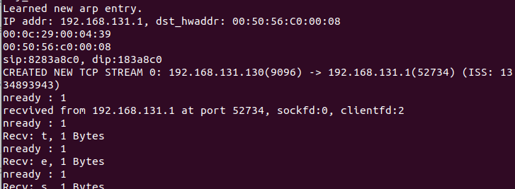
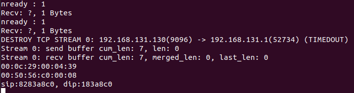

# MuduoNet

基于用户态协议栈(netmap)，参考 muduo 实现的基于 Reactor 模型的多线程网络库。使用 C++ 11 编写去除 muduo 对 boost 的依赖。

项目已经实现了用户态协议栈， Channel 模块、Poller 模块、事件循环模块、定时器模块、异步日志模块、内存池模块。所有模块基本功能测试完成。

# 用户态协议栈

使用netmap库，其是一个高性能的网络框架，允许应用程序直接访问网络设备的发送和接收队列，从而显著减少内核网络栈的开销。

使用dperf协议栈测测试中可以到C10M。

实现了：arp，icmp，ip，eth，udp，tcp协议，epoll，socket，listen，bind系统调用。

## 优化点

减少拷贝：不使用内核的协议栈，而是在应用程序的底层下直接实现，目的是为了减少一次拷贝，即：从网卡直接拷贝到应用程序，中间不经过先拷贝到内核，也就没有中断处理。

使用大页内存：通过使用大块内存提高系统性能的技术。它通过减少页表的大小来提高内存的使用效率，可以有2MB 1GB。

使用伸展树来维护活跃会话：伸展树是一种自平衡的二叉搜索树，在访问或插入操作时会对树进行旋转，使得最近访问的元素更容易被再次访问，从而提高了对访问模式的适应性。

内存屏障：线程之间可能共享和更新数据（如网络缓冲区、流量统计信息等）。使用内存屏障可以确保以下操作的正确顺序和数据一致性。

处理器亲和性：将线程或进程绑定到特定的CPU核心或核心组上，这样可以减少上下文切换和缓存失效，从而提升性能。

使用了 RTO 哈希表：加快路由查找速度: 提高数据包处理效率。高效的路由表更新: 快速处理网络拓扑变化。

使用RSS：RSS 通过将网络流量分配到多个 CPU 核心上，实现负载均衡和提高并行处理能力。RSS 的核心分配是基于哈希值的，这个哈希值通常由源地址、目标地址和端口等信息计算得出。这个计算决定了哪个 CPU 核心处理特定的数据包。

# muduo库

- 底层使用 Epoll + LT 模式的 I/O 复用模型，并且结合非阻塞 I/O 实现主从 Reactor 模型。
- 采用「one loop per thread」线程模型，并向上封装线程池避免线程创建和销毁带来的性能开销。
- 采用 eventfd 作为事件通知描述符，方便高效派发事件到其他线程执行异步任务。
- 基于自实现的双缓冲区实现异步日志，由后端线程负责定时向磁盘写入前端日志信息，避免数据落盘时阻塞网络服务。
- 基于红黑树实现定时器管理结构，内部使用 Linux 的 timerfd 通知到期任务，高效管理定时任务。
- 遵循 RAII 手法使用智能指针管理内存，减小内存泄露风险。
- 参照 Nginx 实现了内存池模块，更好管理小块内存空间，减少内存碎片。

# 并发模型

调用 TcpServer 的 start 函数后，会内部创建线程池。每个线程独立的运行一个事件循环，即 SubReactor。MainReactor 从线程池中轮询获取 SubReactor 并派发给它新连接，处理读写事件的 SubReactor 个数一般和 CPU 核心数相等。使用主从 Reactor 模型有诸多优点：

- 响应快，不必为单个同步事件所阻塞，虽然 Reactor 本身依然是同步的；
- 可以最大程度避免复杂的多线程及同步问题，并且避免多线程/进程的切换；
- 扩展性好，可以方便通过增加 Reactor 实例个数充分利用 CPU 资源；
- 复用性好，Reactor 模型本身与具体事件处理逻辑无关，具有很高的复用性；

# 协议栈测试效果

使用Windows本地机发送tcp请求：

  

时间过长无数据自动断开TCP流